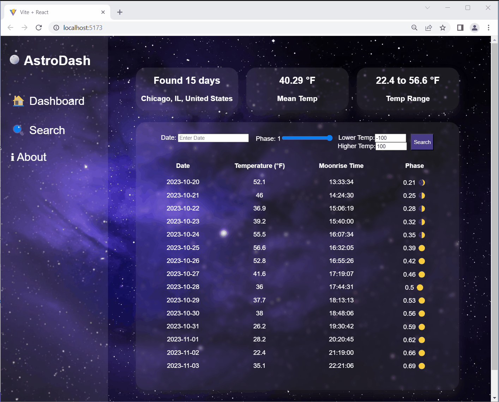

# Astro Data Dashboard  
This is a weather data app that provides daily weather forecasts and moon phases in Chicago. Users can search for weather data based on date, moon phase, and temperature ranges. Whether you're planning an outdoor activity, a romantic night under the moon, or are just curious about the weather and lunar phases, this app has you covered!

## How to Use This App?  
The app offers various filters to search for weather data:
**Date**: You can filter data by entering a specific date.
**Phase**: Use the slider to set the moon phase.
**Temperature**: You can set a lower and upper temperature limit to narrow down the search.
Once the filters are set, click the "Search" button to view the filtered data.

## Video Walkthrough  
Part 1  

Part 2  

## Features  
Part 1 
- [X] The list displays a list of data fetched using an API call
- [X] Data uses the useEffect React hook and async/await syntax
- [X] The app dashboard includes summary statistics about the data
  - [X] *The total number of records (days) found*
  - [X] *Mean Temparature of the shown records*
  - [X] *Temparature Range of the shown records*
- [X] A search bar allows the user to search for an item in the fetched data
- [X] Multiple different filters (2+) allow the user to filter items in the database by specified categories
- [X] Multiple filters can be applied simultaneously
- [X] Filters use different input types such as a text input, a selection, or a slider
- [X] The user can enter specific bounds for filter values

Part 2  
- [X] The app includes at least one unique chart developed using the fetched data that tell an interesting story
- [X] Clicking on an item in the list view displays more details about it
- [X] Clicking on an item has a direct, unique link to that item's detail view page
- [X] The site's customized dashboard contains more content that explains what is interesting about the data
- [X] The site allows users to toggle between different data visualizations
- [X] Add an about page

## Usage  
- Install Node.js and clone the repository
- Go to https://www.visualcrossing.com/weather-api and get your API key.
- Create a new file called .env in your project folder and add the following line:
`VITE_APP_ACCESS_KEY='your_api_key_here'`
Replace your_api_key_here with your actual API key.
- Navigate to the project directory and install dependencies: `npm install`  
- Start the development server: `npm run dev`
